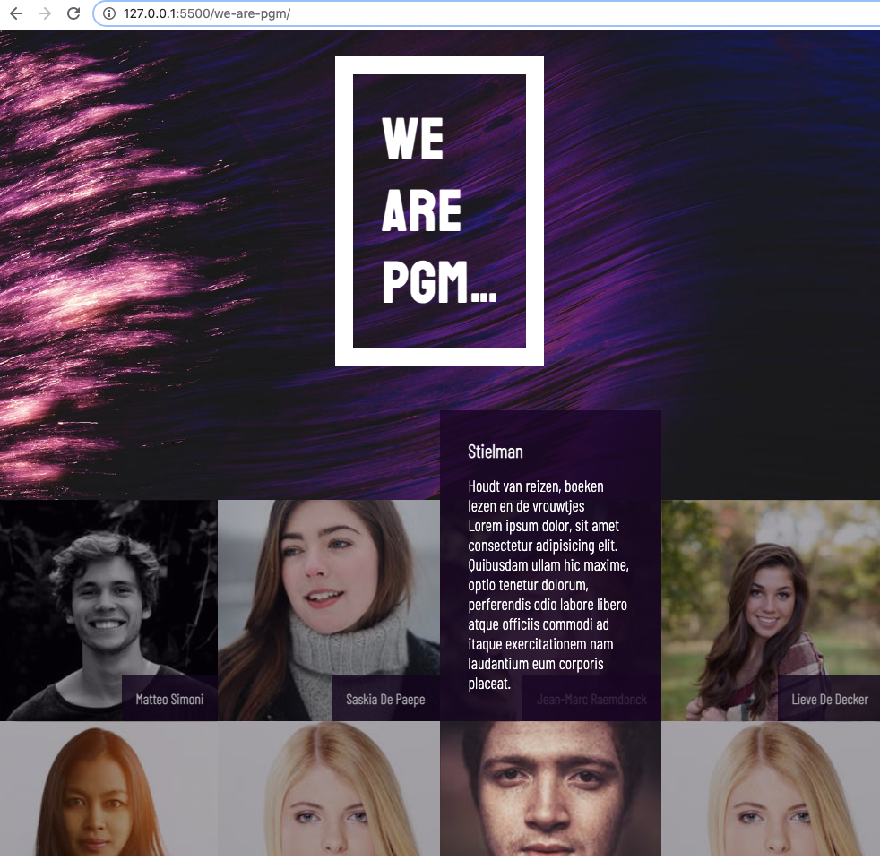

## We Are PGM

**PGM-a en PGM-b becomes one 💪.**  
_Dat verdient een stevige introductie, en hoe kunnen we dat beter aanpakken dat data-gewijs een webpage vullen._

Deze oefening bestaat uit **twee** delen

### Data ophalen en presenteren



Download de startcode van de frontend uit deze Github Repository.
Ontwikkel een script dat alle studenten ophaalt via een `GET`-request uit de API via volgend endpoint.

```
API_URL     https://we-are-pgm.herokuapp.com
  POST /student -> bewaren van een student
  GET /student -> haalt studenten op
```

Breng de gegevens van de studenten in de DOM. Er staat al één voorbeeldje in `index.html` hoe een volledig student-element opgebouwd is.

### Jouw data sturen

Maak een JSON-object aan waarin alle interessante details over jezelf in aanwezig zijn. De JSON moet minstens volgende informatie bevatten

    firstname : string
    lastname : string
    nickname : string
    classname : string // 1PGM-a of 1PGM-b
    email : string
    age : number
    avatar : string // link naar de afbeelding, gebruik een service als https://postimg.cc/
    hobbies : array
    motto : string // een motto die jou typeert
    about : string // stel jezelf kort voor

Schrijf een script (welke je later uitvoert via `node.js`) waarbij je deze JSON via een `POST`-request verstuurt naar volgende `API`

```
API_URL     https://we-are-pgm.herokuapp.com
  POST /student -> bewaren van een student
  GET /student -> haalt studenten op
```